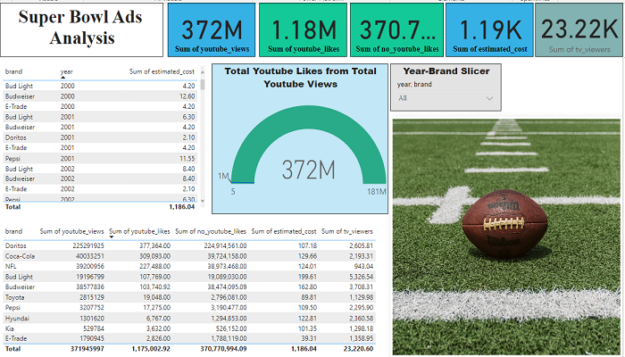
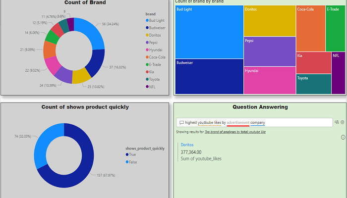

### **Super Bowl Ads Analysis**

This project was accomplished using two Python programming language & Microsoft PowerBI. 

The original data can be found in the **original_data** folder

Python was primarily used for the following;
- Loading the data.
- Getting to know the data.
    - *Renaming columns.*
    - *Data cleaning.*
- Memory management. 
- Feature engineering.
- Exploratory data analysis. 
- Drawing observations and conclusions from plots, tables and other visualisations.

Please kindly check **superbowl_ads.ipynb** for the analysis using Python.

Using Python laid the foundation for Microsoft PowerBI visualisations which could be seen in the the **powerbi_analysis** folder. This was made using the **analysis.csv** dataset produced from the Python analysis found in the **my_data** folder.

### **Some images from PowerBI**

### **Conclusion**

- From the observations and taking into account of Youtube likes and views, Doritos is the most successful among the rest as the estimated cost of running its ads is relatively low compared to the top spender like Budweiser, Bud Light & Coca-Cola whose. 
- Investors could make a solid profit with minimum cost on Doritos.